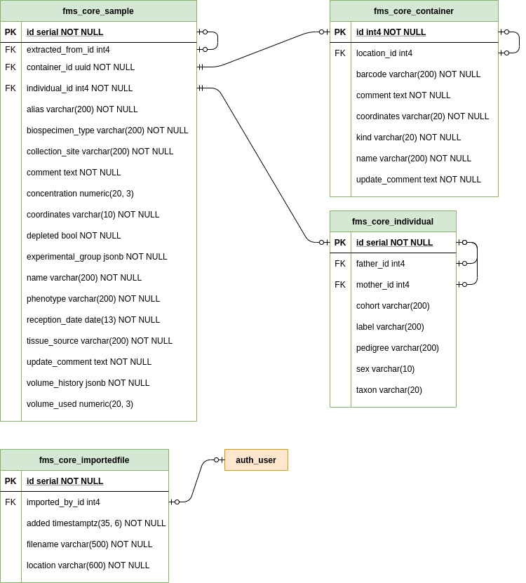

# C3G FreezeMan Server


[](https://codecov.io/gh/c3g/freezeman_server)

FreezeMan is a freezer management system designed to manage the storage and 
tracking of biological samples in a laboratory environment.

## Table of contents

  * [License](#license)
  * [Dependencies](#dependencies)
  * [Running locally for development](#running-locally-for-development)
  * [Running tests](#running-tests)
  * [Creating releases](#creating-releases)
  * [Deploying to production](#deploying-to-production)
  * [Database diagram](#database-diagram)

## License

Copyright &copy; the 
[Canadian Centre for Computational Genomics](http://www.computationalgenomics.ca/), 
McGill University 2020. All rights reserved. FreezeMan is licensed under the 
GNU Lesser General Public License version 3. See project license in `/LICENSE`. 

Portions copyright &copy; Django Software Foundation and individual
contributors to the Django project.

See relevant license in the following files:

  * `/templates/admin/base_site.html`

Portions copyright &copy; Bojan Mihelac and individual contributors to the 
`django-import-export` project.

See relevant license in the following files:

  * `/fms_core/templates/admin/fms_core/change_list_export_version.html`
  * `/fms_core/templates/admin/fms_core/change_list_import_export_version.html`
  * `/fms_core/templates/admin/fms_core/download_import.html`

Port of [fzy.js](https://github.com/jhawthorn/fzy.js) licensed under MIT License.

## Dependencies

  * Python 3.6 or later
  * Django 3
  * Postgres 9.5 or later (tested on 11 and 12)
  
Python package dependencies are listed in `requirements.txt`.
  
## Running locally for development

  1. Clone the repository
  
     ```bash
     git clone https://github.com/c3g/fms.git
     ```
  
  2. Set up a virtual environment with Python 3.6 or later, and install 
     dependencies into it:
     
     ```bash
     virtualenv -p python3 ./env
     source env/bin/activate
     pip install -r requirements.txt
     ```
     
  3. Create a database for the application to use locally in Postgres. The
     following environment variables (listed here with defaults) can be used
     to set up the Postgres connection:
     
     ```bash
     export PG_DATABASE=fms
     export PG_USER=admin
     export PG_PASSWORD=admin
     export PG_HOST=127.0.0.1
     export PG_PORT=5432
     ```
     
  4. Run any outstanding migrations:
  
     ```bash
     python ./manage.py migrate
     ```
    
  5. Create an application superuser:
  
     ```bash
     python ./manage.py createsuperuser
     ```
    
  6. Run the development server:
  
     ```bash
     python ./manage.py runserver
     ```
     
## Running tests

Make sure all database configuration has been done successfully with a user
that can create new databases (in order to create the test-specific database.)
Then, run the following command:

```bash
coverage run ./manage.py test
```

## Creating releases

  1. Update the `VERSION` file in the repository to represent the current
     version number, according to semantic versioning.
     
  2. Squash any migrations between the last version and the new version and
     name it `vX_Y_Z` where the version reflects the new semantic version
     number stored in the `VERSION` file. There should be **at most one
     migration per version.** Do not use `.` to separate version components,
     it breaks Django for some reason.
     
  3. Tag a new release on GitHub, following the format `vX.Y.Z` where `X` is
     the major version, `Y` is the minor version, and `Z` is the patch version.

## Deploying to production

  * Use NGINX or Apache HTTPD as a reverse proxy
    * Remember to serve static and media files using the proxy instead of
      Django **for security and performance reasons**
    * Static files are collected to the application `staticfiles/` directory
    * Media files are kept in the `media/` directory
    * For example uWSGI and NGINX configurations, see `example.uwsgi.ini` and
      `example.nginx.conf` respectively
  
  * Use a WSGI server such as uWSGI or Gunicorn
  
  * Set a secret key in `settings.py` different from the default repository
    value **for security reasons**
  
  * Make sure to set `FMS_DEBUG=False` and `FMS_HOST=your.domain.org` in the
    production environment **for security reasons** and for the site to 
    function correctly
    
  * Configure the Postgres connection using any of the following environment
    variables, where the default value is not sufficient:
    
    * `PG_DATABASE`: Postgres database name. Default: `fms`
    * `PG_USER`: Postgres username. Default: `admin`
    * `PG_PASSWORD`: Postgres user password. Default: `admin`
    * `PG_HOST`: Postgres database host. Default: `localhost`
    * `PG_PORT`: Postgres database port. Default: `5432`
    
  * Any time a new version is deployed, remember to run the following
    management commands:
    
    * `./manage.py collectstatic` - Moves all static files into the
      `staticfiles/` directory
    * `./manage.py migrate` - Migrates the database to the latest version
    

## Database diagram



