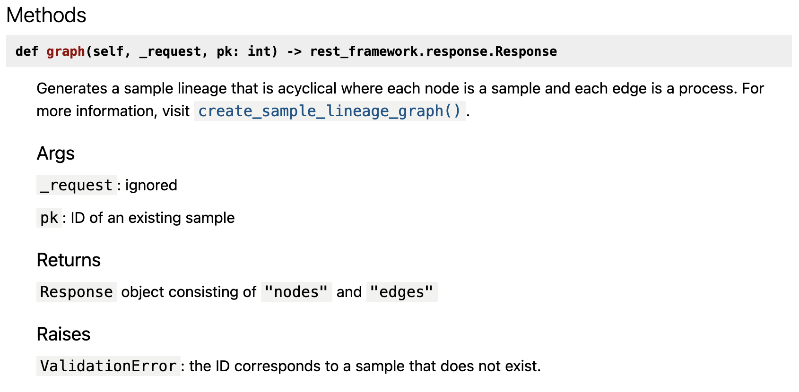

# Contributing

## Documentation

### Type Annotation

Always use type annotation!

For more information, visit: https://docs.python.org/3.8/library/typing.html

### Document Generation

This project uses pdoc3 to generate documentation for `fms_core`.
For more information on pdoc3, visit: <https://pdoc3.github.io/pdoc/doc/pdoc/#gsc.tab=0>

### Usage

```txt
python manage.py createdocs --help
usage: manage.py createdocs [-h] [--output OUTPUT] [--version] [-v {0,1,2,3}] [--settings SETTINGS]
                            [--pythonpath PYTHONPATH] [--traceback] [--no-color] [--force-color] [--skip-checks]
                            modules [modules ...]

Generates documentation for python modules

positional arguments:
  modules               The Python module name. This may be an import path resolvable in the current environment, or
                        a file path to a Python module or package.

optional arguments:
  -h, --help            show this help message and exit
  --output OUTPUT       The directory to output generated documents to (default: ./docs)
  --version             show program's version number and exit
  -v {0,1,2,3}, --verbosity {0,1,2,3}
                        Verbosity level; 0=minimal output, 1=normal output, 2=verbose output, 3=very verbose output
  --settings SETTINGS   The Python path to a settings module, e.g. "myproject.settings.main". If this isn't
                        provided, the DJANGO_SETTINGS_MODULE environment variable will be used.
  --pythonpath PYTHONPATH
                        A directory to add to the Python path, e.g. "/home/djangoprojects/myproject".
  --traceback           Raise on CommandError exceptions
  --no-color            Don't colorize the command output.
  --force-color         Force colorization of the command output.
  --skip-checks         Skip system checks.
```

### Example

```txt
. ./env/bin/activate
pip install -r requirements.txt
python manage.py createdocs fms_core
```

This will generate documents of python codes in `fms_core` under the `docs/` directory.

### Extension

If you're a vscode user, it is highly recommended that you use the [autoDocstring](https://marketplace.visualstudio.com/items?itemName=njpwerner.autodocstring) extension from Nils Werner to automatically generate docstrings.

### docstring Format

The only acceptable docstring formats are: [Numpydoc](https://numpydoc.readthedocs.io/en/latest/), [Google](https://github.com/google/styleguide/blob/gh-pages/pyguide.md#38-comments-and-docstrings) and [pep257](https://peps.python.org/pep-0257/) without type. For more information, visit: <https://stackoverflow.com/a/24385103>.

To produce the most optimal docstring for pdoc3, use
the Google format without type. This can be configured in autoDocstring with `autoDocstring.docstringFormat` set to `google-notypes`.

A docstring should look like this which is in `fms_core/viewsets/sample_lineage.py`:

```python
def graph(self, _request, pk: int) -> Response:
    """
    Generates a sample lineage that is acyclical where each node is a sample and each edge is a process.
    For more information, visit `fms_core.services.sample_lineage.create_sample_lineage_graph`.

    Args:
        `_request`: ignored

        `pk`: ID of an existing sample

    Returns:
        `Response` object consisting of `"nodes"` and `"edges"`

    Raises:
        `ValidationError`: the ID corresponds to a sample that does not exist.
    """
```

As you can see...

- There is one line space between parameters. This is to ensure that they appear on separate lines in the pdoc3.
- Use backticks to emphasize that it is present in the code.
- Use backticks for module path (e.g. `` `fms_core.services.sample_lineage.create_sample_lineage_graph` ``). pdoc3 will recognize this as a module path and try to display only function/class name with hyperlink.

Here's the result:

